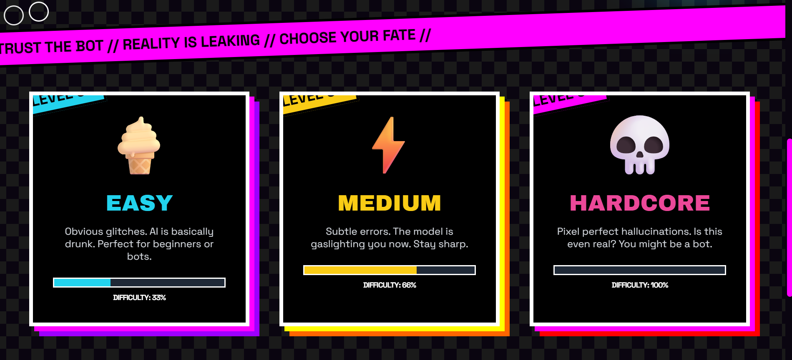
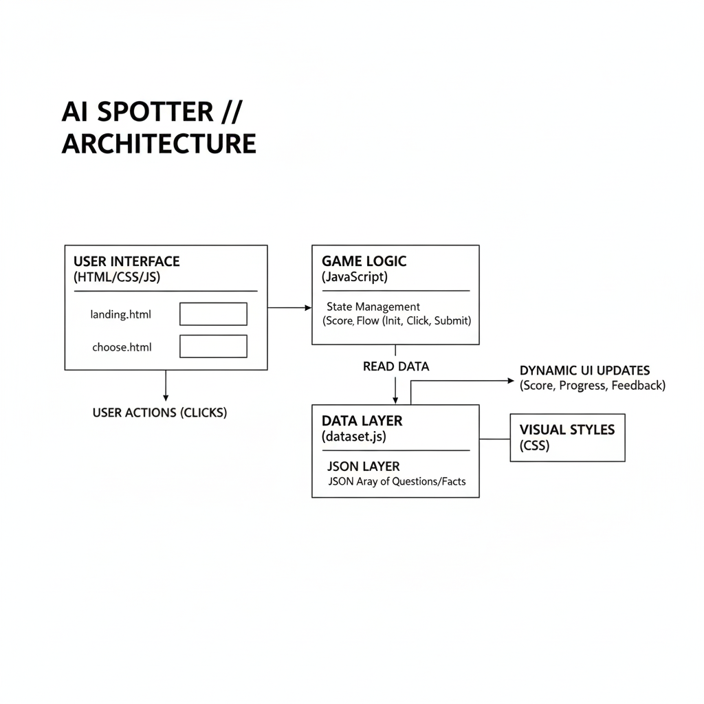
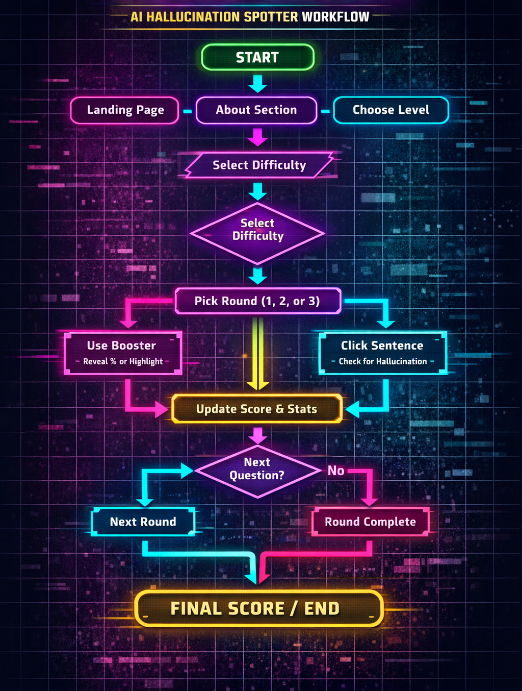

<p align="center">
  
</p>

# AI Hallucination Spotter Game 🎯

## Basic Details
AI Hallucination Spotter is an interactive web-based educational game designed to improve users’ ability to detect misinformation generated by artificial intelligence systems.
The application presents users with short factual paragraphs containing one subtly incorrect or “hallucinated” sentence. The user’s task is to identify the false statement. After each attempt, the system provides instant feedback along with an explanation, helping users understand common patterns of AI hallucinations such as incorrect dates, wrong locations, fabricated statistics, or misattributed facts.
The platform aims to promote digital literacy and critical thinking by training users to evaluate AI-generated content rather than trusting it blindly.


### Team Name: COSMIC PAL

### Team Members
- Member 1: LIYA ELIZABETH ROJI :VJCET
- Member 2: ANSA SHIBU :VJCET

### Hosted Project Link
https://aihallu.vercel.app/

### Project Description
Project Description
AI Hallucination Spotter is an interactive, web-based educational game designed to sharpen a user's ability to detect misinformation generated by Artificial Intelligence. In an era where generative AI is increasingly used for information gathering, this platform serves as a training ground for digital literacy and critical thinking.

The application presents users with short, factual paragraphs where one sentence is a "hallucination"—a statement that is subtly incorrect, misattributed, or entirely fabricated

### The Problem statement
As generative AI tools become widely used in education, research, and daily life, users increasingly rely on AI-generated content. However, AI systems can produce confident but incorrect information, known as hallucinations. Many users lack the skills to identify these inaccuracies, leading to misinformation spread and poor decision-making.

### The Solution
To define The Solution, you need to explain how your game moves a user from being a passive consumer of AI to an active, critical thinker. Since you are using a lightweight HTML/CSS/JS stack, the solution is focused on speed, accessibility, and immediate cognitive reinforcement.

The Solution
The AI Hallucination Spotter solves the problem of "AI over-reliance" by providing a controlled, gamified environment where users can fail safely while learning to identify misinformation. The solution is built on three strategic pillars:

1. Active Scrutiny over Passive Reading
Instead of just reading AI-generated text for information, users are tasked with "hunting" for an error. This shifts the brain into a critical-analytical mode, making them more likely to spot subtle inconsistencies like wrong dates or fabricated statistics that would otherwise be ignored.

2. Pattern Recognition Training
By categorizing hallucinations (e.g., Temporal, Logical, or Statistical), the game teaches users the "DNA" of AI errors. This allows them to build a mental framework for spotting similar "hallucination patterns" when using AI tools like ChatGPT or Gemini in their daily lives.

3. The Immediate Feedback Loop
The solution provides instant validation. When a user identifies (or misses) a hallucination, the system immediately reveals the Factual Truth and explains why the AI got it wrong. This converts a simple game into a high-impact educational tool.

---

## Technical Details

### Technologies/Components Used

**For Software:**
- Languages used: [e.g., html,css,js]
- Frameworks used: [e.g., JS]
- Libraries used: [e.g., JUnit]
- Tools used: [e.g., VS Code, Git]


## Features

Feature 1: Interactive "Sentence-Level" Scrubbing
The interface uses a custom JavaScript parser to break down AI-generated paragraphs into individual clickable elements. This allows users to pinpoint the exact moment an AI "hallucinates" rather than just guessing the general topic.

Feature 2: Categorized Hallucination Logic
The game doesn't just show "wrong" facts; it pulls from a structured JS dataset that classifies errors into types like Temporal Glitches (wrong dates), Statistical Fabrications (fake data), and Logic Loops. This helps users recognize the patterns of AI failure.

Feature 3: Instant "Truth-Card" Feedback
Using CSS transitions and JS event listeners, the app provides immediate visual feedback. Once a user clicks, a "Truth-Card" modal appears, revealing the verified factual source and explaining the specific nature of the AI's error.

Feature 4: Dynamic Session Randomization
To ensure replayability, the JavaScript engine uses a "Fisher-Yates Shuffle" algorithm on the dataset. Every time a user refreshes or starts a new round, the order of challenges changes, preventing memorization and forcing genuine critical thinking.

Feature 5: Performance Analytics Dashboard
A lightweight, browser-based scoring system tracks the user's "Detection Accuracy" and "Average Spotting Time." This gamified progress tracking motivates users to sharpen their skeptical eye over multiple sessions.

---

## Implementation

### For Software:

#### Installation
```bash
[Installation commands - e.g., npm install, pip install -r requirements.txt]
```

#### Run
```bash
[Run commands - e.g., npm start, python app.py]
```


## Project Documentation

### For Software:

#### Screenshots (Add at least 3)


*Caption: Main selection and intro screen*


*Caption: Example round where the user identifies a hallucinated sentence*


*Caption: Post-round feedback and score summary*

#### Diagrams

**System Architecture:**


*Caption: System architecture overview*
*Explain your system architecture - components, data flow, tech stack interaction*

**Application Workflow:**


*Caption: High-level application flow diagram*

---

### For Hardware:

#### Schematic & Circuit


*Add caption explaining connections*


*Add caption explaining the schematic*

#### Build Photos


*Caption: Project team*


*Explain the final build*

---

## Additional Documentation

### For Web Projects with Backend:

#### API Documentation

**Base URL:** `https://api.yourproject.com`

##### Endpoints

**GET /api/endpoint**
- **Description:** [What it does]
- **Parameters:**
  - `param1` (string): [Description]
  - `param2` (integer): [Description]
- **Response:**
```json
{
  "status": "success",
  "data": {}
}
```

**POST /api/endpoint**
- **Description:** [What it does]
- **Request Body:**
```json
{
  "field1": "value1",
  "field2": "value2"
}
```
- **Response:**
```json
{
  "status": "success",
  "message": "Operation completed"
}
```

[video: ai_hallucination_spotter (1).mp4]

---

### For Mobile Apps:

#### App Flow Diagram


*Explain the user flow through your application*

#### Installation Guide

**For Android (APK):**
1. Download the APK from [Release Link]
2. Enable "Install from Unknown Sources" in your device settings:
   - Go to Settings > Security
   - Enable "Unknown Sources"
3. Open the downloaded APK file
4. Follow the installation prompts
5. Open the app and enjoy!

**For iOS (IPA) - TestFlight:**
1. Download TestFlight from the App Store
2. Open this TestFlight link: [Your TestFlight Link]
3. Click "Install" or "Accept"
4. Wait for the app to install
5. Open the app from your home screen

**Building from Source:**
```bash
# For Android
flutter build apk
# or
./gradlew assembleDebug

# For iOS
flutter build ios
# or
xcodebuild -workspace App.xcworkspace -scheme App -configuration Debug
```

---

### For Hardware Projects:

#### Bill of Materials (BOM)

| Component | Quantity | Specifications | Price | Link/Source |
|-----------|----------|----------------|-------|-------------|
| Arduino Uno | 1 | ATmega328P, 16MHz | ₹450 | [Link] |
| LED | 5 | Red, 5mm, 20mA | ₹5 each | [Link] |
| Resistor | 5 | 220Ω, 1/4W | ₹1 each | [Link] |
| Breadboard | 1 | 830 points | ₹100 | [Link] |
| Jumper Wires | 20 | Male-to-Male | ₹50 | [Link] |
| [Add more...] | | | | |

**Total Estimated Cost:** ₹[Amount]

#### Assembly Instructions

**Step 1: Prepare Components**
1. Gather all components listed in the BOM
2. Check component specifications
3. Prepare your workspace

*Caption: All components laid out*

**Step 2: Build the Power Supply**
1. Connect the power rails on the breadboard
2. Connect Arduino 5V to breadboard positive rail
3. Connect Arduino GND to breadboard negative rail

*Caption: Power connections completed*

**Step 3: Add Components**
1. Place LEDs on breadboard
2. Connect resistors in series with LEDs
3. Connect LED cathodes to GND
4. Connect LED anodes to Arduino digital pins (2-6)

*Caption: LED circuit assembled*

**Step 4: [Continue for all steps...]**

**Final Assembly:**

*Caption: Completed project ready for testing*

---

### For Scripts/CLI Tools:

#### Command Reference

**Basic Usage:**
```bash
python script.py [options] [arguments]
```

**Available Commands:**
- `command1 [args]` - Description of what command1 does
- `command2 [args]` - Description of what command2 does
- `command3 [args]` - Description of what command3 does

**Options:**
- `-h, --help` - Show help message and exit
- `-v, --verbose` - Enable verbose output
- `-o, --output FILE` - Specify output file path
- `-c, --config FILE` - Specify configuration file
- `--version` - Show version information

**Examples:**

```bash
# Example 1: Basic usage
python script.py input.txt

# Example 2: With verbose output
python script.py -v input.txt

# Example 3: Specify output file
python script.py -o output.txt input.txt

# Example 4: Using configuration
python script.py -c config.json --verbose input.txt
```

#### Demo Output

**Example 1: Basic Processing**

**Input:**
```
This is a sample input file
with multiple lines of text
for demonstration purposes
```

**Command:**
```bash
python script.py sample.txt
```

**Output:**
```
Processing: sample.txt
Lines processed: 3
Characters counted: 86
Status: Success
Output saved to: output.txt
```

**Example 2: Advanced Usage**

**Input:**
```json
{
  "name": "test",
  "value": 123
}
```

**Command:**
```bash
python script.py -v --format json data.json
```

**Output:**
```
[VERBOSE] Loading configuration...
[VERBOSE] Parsing JSON input...
[VERBOSE] Processing data...
{
  "status": "success",
  "processed": true,
  "result": {
    "name": "test",
    "value": 123,
    "timestamp": "2024-02-07T10:30:00"
  }
}
[VERBOSE] Operation completed in 0.23s
```

---

## Project Demo

### Video
[Add your demo video link here - YouTube, Google Drive, etc.]

*Explain what the video demonstrates - key features, user flow, technical highlights*

### Additional Demos
[Add any extra demo materials/links - Live site, APK download, online demo, etc.]

---

## AI Tools Used (Optional - For Transparency Bonus)

If you used AI tools during development, document them here for transparency:

**Tool Used:** [e.g., GitHub Copilot, v0.dev, Cursor, ChatGPT, Claude]

**Purpose:** [What you used it for]
- Example: "Generated boilerplate React components"
- Example: "Debugging assistance for async functions"
- Example: "Code review and optimization suggestions"

**Key Prompts Used:**
- "Create a REST API endpoint for user authentication"
- "Debug this async function that's causing race conditions"
- "Optimize this database query for better performance"

**Percentage of AI-generated code:** [Approximately X%]

**Human Contributions:**
- Architecture design and planning
- Custom business logic implementation
- Integration and testing
- UI/UX design decisions

*Note: Proper documentation of AI usage demonstrates transparency and earns bonus points in evaluation!*

---

## Team Contributions

- [Name 1]: [Specific contributions - e.g., Frontend development, API integration, etc.]
- [Name 2]: [Specific contributions - e.g., Backend development, Database design, etc.]
- [Name 3]: [Specific contributions - e.g., UI/UX design, Testing, Documentation, etc.]

---

## License

This project is licensed under the [LICENSE_NAME] License - see the [LICENSE](LICENSE) file for details.

**Common License Options:**
- MIT License (Permissive, widely used)
- Apache 2.0 (Permissive with patent grant)
- GPL v3 (Copyleft, requires derivative works to be open source)

---

Made with ❤️ at TinkerHub
